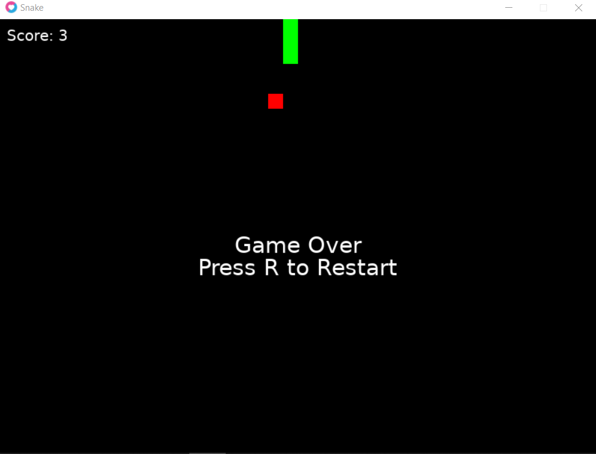

# SNAKE COM LOVE
👨‍💻SNAKE É UM JOGO CLÁSSICO EM QUE O JOGADOR CONTROLA UMA COBRA QUE SE MOVE PELA TELA EM BUSCA DE COMIDA.

 <br>

## DESCRIÇÃO:
**Snake** é um jogo clássico em que o jogador controla uma cobra que se move pela tela em busca de comida. Cada vez que a cobra come uma comida, ela cresce em tamanho, tornando o jogo mais desafiador. O jogo termina se a cobra colidir com as bordas da tela ou com o próprio corpo. 

O objetivo é controlar a cobra para coletar a comida que aparece aleatoriamente na tela, fazendo-a crescer e aumentar a pontuação. O desafio está em evitar colisões com as bordas da tela e com o próprio corpo da cobra.

## COMO JOGAR?
- **Execute o Jogo**: 
  - Abra o terminal (ou prompt de comando) e navegue até a pasta `./main.lua`.
  - Execute o comando:

   ```bash
   love .
   ```

  - Isso deve abrir uma janela do LÖVE com o jogo do SNAKE.

- **Movimentação**:
  - **Seta para cima**: Move a cobra para cima.
  - **Seta para baixo**: Move a cobra para baixo.
  - **Seta para esquerda**: Move a cobra para a esquerda.
  - **Seta para direita**: Move a cobra para a direita.

- **Regras do Jogo**:
  - A cobra se move continuamente na direção atual.
  - A comida aparece aleatoriamente na tela. Quando a cobra come a comida, ela cresce e a pontuação aumenta.
  - O jogo termina se a cobra colidir com as bordas da tela ou com o próprio corpo.

- **Reiniciar o Jogo**:
  - Quando o jogo termina com "Game Over", pressione a tecla **`R`** para reiniciar o jogo.

## NÃO SABE?
- Entendemos que para manipular arquivos em muitas linguagens e tecnologias, é necessário possuir conhecimento nessas áreas. Para auxiliar nesse aprendizado, oferecemos cursos gratuitos disponíveis:
* [CURSO DE LOVE](https://github.com/VILHALVA/CURSO-DE-LOVE)
* [CURSO DE LUA](https://github.com/VILHALVA/CURSO-DE-LUA)
* [CONFIRA MAIS CURSOS](https://github.com/VILHALVA?tab=repositories&q=+topic:CURSO)

## CREDITOS:
- [PROJETO CRIADO PELO VILHALVA](https://github.com/VILHALVA)
